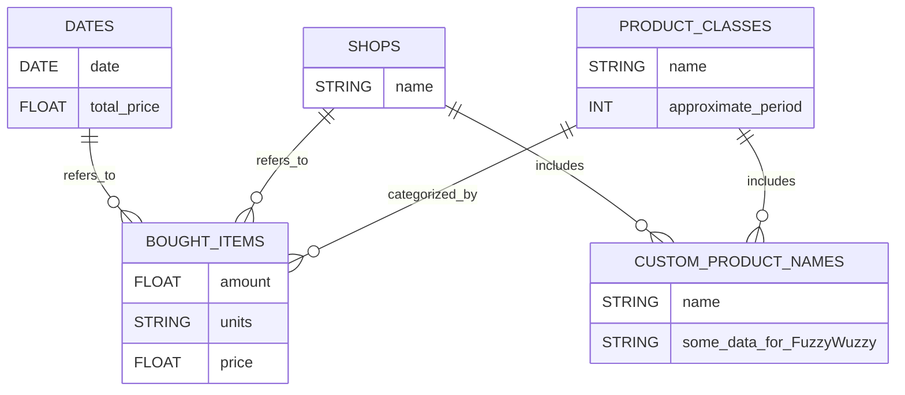

# Zapoctovy program uctenky
- goal of this project is to store bought items from pictures of receipts

## User manual
- create virtual environment
- install requirements
- create environment variables:
    - GROQ_API_KEY (from https://console.groq.com/keys)
    - OCR_API_KEY (from https://ocr.space/OCRAPI/confirmation)
    - DB_HOST = "127.0.0.1" / get your remote one
    - DB_USER = "root" / custom one
    - DB_PASSWORD (password for your database)
    - DB_DATABASE (name of your database)
- run `python mainInput.py` to start the program
- save picture of receipt and provide path to it
- program will store items from receipt to database

- reading from db is not implemented yet

## Technical manual
- program is written in **Python** and **MySQL**
- main code is in **mainInput.py** which uses other files for functions and objects
- program **getImage** just copes image from path to image folder for further processing
- program **imageToText** uses OCR API to get text from image (you can replace it with another one)
- program **textAnalyzer** user artificial intelligence to go through text of receipt assign items to categories 
- program **database** is used to store in MySQL database

- planning to create object with will be dedicated to communicate with user via console / api

### This is how scheme of MySQL database looks like:

