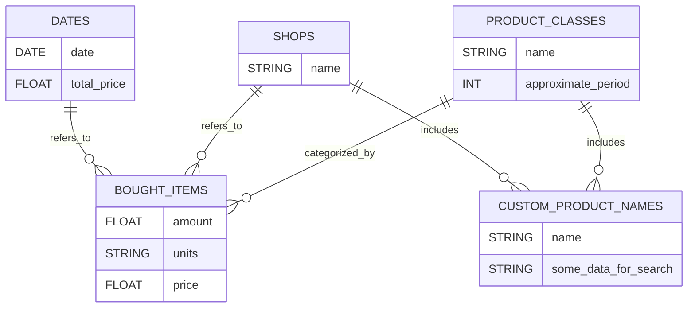

Specifikace zápočtového programu:

téma:  
Tvoření záznamu rozpočtu na základě sbírání dat z účtenek ze supermarketů

Možné uživatelské vstupy:
- Jako vstupní data může uživatel zadat do programu cestu k (jednomu najednou) obrázku účtenky který program zpracuje, uloží zísakná data do databáze a případně se zeptá uživatele na to, co který produkt doopravdy znamená.
- Pomocí programu bude moci zjistit (budu to psát jako příklady s proměnnými v hranatých závorkách: 
    - kolik utratil za poslední [měsíc]
    - kolik stojí [jablka] posledního [půl roku]
    - kolik utrajil za [jablka] tento [týden]
    - kolim utratil za poslední [týden] v [Albertu]

Průběh zpracování:
- obrázek účtenky se odešle pomocí API k OCR space 
- Pomocí jazykového modelu - nějaký který je volně dostupný na Groq (pravděpodobně Llama 3.1 několik B) se zpracuje text účtenky a převede se na JSON, aby bylo snadno poznat název kterého produktu patří ke které peněžní hodně.
- Produkty na účtenkách mají různá, zvláštní jména která značí co je to za produkt, prto je důležité tato jména správně přiřadit k nadřazenému typu - třeba "červená jablka" k jablkům nebo "JOG.SELSKÝ ČOKO.200G" k jogurtům. Toto přiřazení nejprve proběhne prohledáním databáze s uloženými těmito zvláštními názvy (do databáze se uloží jako indexy další data pro zrychlení tohoto procesu) které se pak ještě zkontrolují porovnáváním stringů (třeba fuzzy-wuzzy knihovny).
- pokud předchozí způsob nepomůže, pošle se dotaz opět jazykovému modelu a pak se výsledek ověří u uživatele
- produkty i s cenou se uloží do MySql databáze zde je přibližné schéma:

