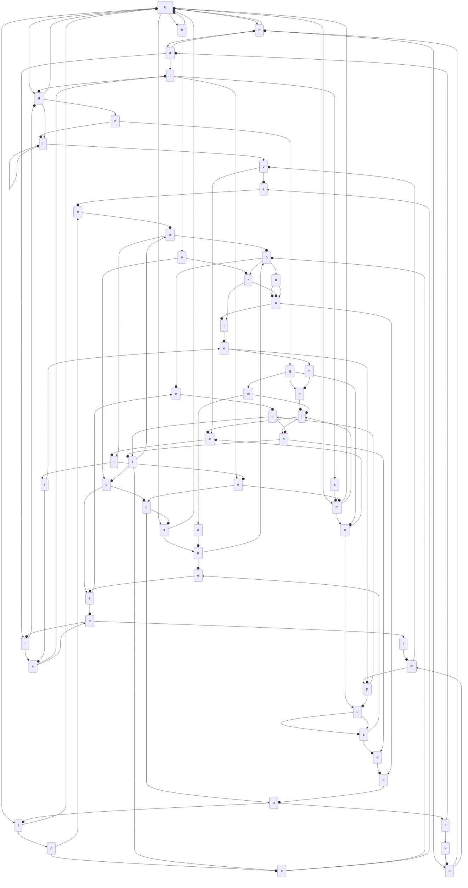

```mermaid
graph TD
0-->1(c)
1--o 0
0-->2(d)
2--o 0
0-->3(m)
3--o 0
0-->4(h)
4--o 0
0-->5(s)
5--o 0
0-->6(i)
6--o 0
1-->7(a)
7--o 1
1-->8(o)
8--o 1
2-->9(o)
9--o 10
2-->10(i)
10--o 10
3-->11(o)
11--o 32
3-->12(i)
12--o 32
4-->13(o)
13--o 37
5-->14(p)
14--o 42
6-->15(c)
15--o 51
7-->16(t)
16--o 2
7-->17(r)
17--o 2
8-->18(m)
18--o 20
9-->19(g)
19--o 11
10-->20(c)
20--o 54
11-->21(u)
21--o 33
12-->22(c)
22--o 48
13-->23(u)
23--o 38
14-->24(o)
24--o 43
15-->25(e)
25--o 52
16-->26(s)
26--o 3
16-->27(e)
27--o 3
17-->28(e)
28--o 16
18-->29(p)
29--o 21
19-->30(s)
30--o 12
19-->31(m)
31--o 12
20-->32(e)
32--o 55
21-->33(s)
33--o 34
22-->34(e)
34--o 49
23-->35(s)
35--o 39
24-->36(u)
36--o 44
24-->37(r)
37--o 44
27-->38(g)
38--o 5
28-->39(e)
39--o 17
29-->40(u)
40--o 22
31-->41(a)
41--o 14
33-->42(e)
42--o 35
35-->43(e)
43--o 40
36-->44(s)
44--o 45
37-->45(t)
45--o 57
38-->46(o)
46--o 6
39-->47(r)
47--o 18
40-->48(t)
48--o 23
44-->49(e)
49--o 46
46-->50(r)
50--o 7
48-->51(e)
51--o 24
48-->52(a)
52--o 24
50-->53(y)
53--o 8
51-->54(r)
54--o 25
52-->55(t)
55--o 27
55-->56(i)
56--o 28
56-->57(o)
57--o 29
57-->58(n)
58--o 30
```