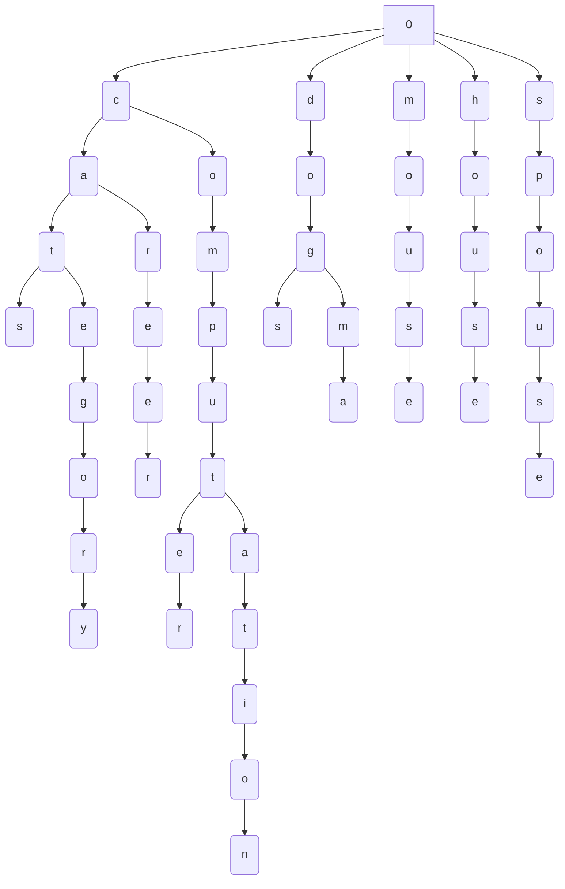

```mermaid
graph TD
0-->1(c)
0-->2(d)
0-->3(m)
0-->4(h)
0-->5(s)
1-->6(a)
1-->7(o)
2-->8(o)
3-->9(o)
4-->10(o)
5-->11(p)
6-->12(t)
6-->13(r)
7-->14(m)
8-->15(g)
9-->16(u)
10-->17(u)
11-->18(o)
12-->19(s)
12-->20(e)
13-->21(e)
14-->22(p)
15-->23(s)
15-->24(m)
16-->25(s)
17-->26(s)
18-->27(u)
20-->28(g)
21-->29(e)
22-->30(u)
24-->31(a)
25-->32(e)
26-->33(e)
27-->34(s)
28-->35(o)
29-->36(r)
30-->37(t)
34-->38(e)
35-->39(r)
37-->40(e)
37-->41(a)
39-->42(y)
40-->43(r)
41-->44(t)
44-->45(i)
45-->46(o)
46-->47(n)
```
