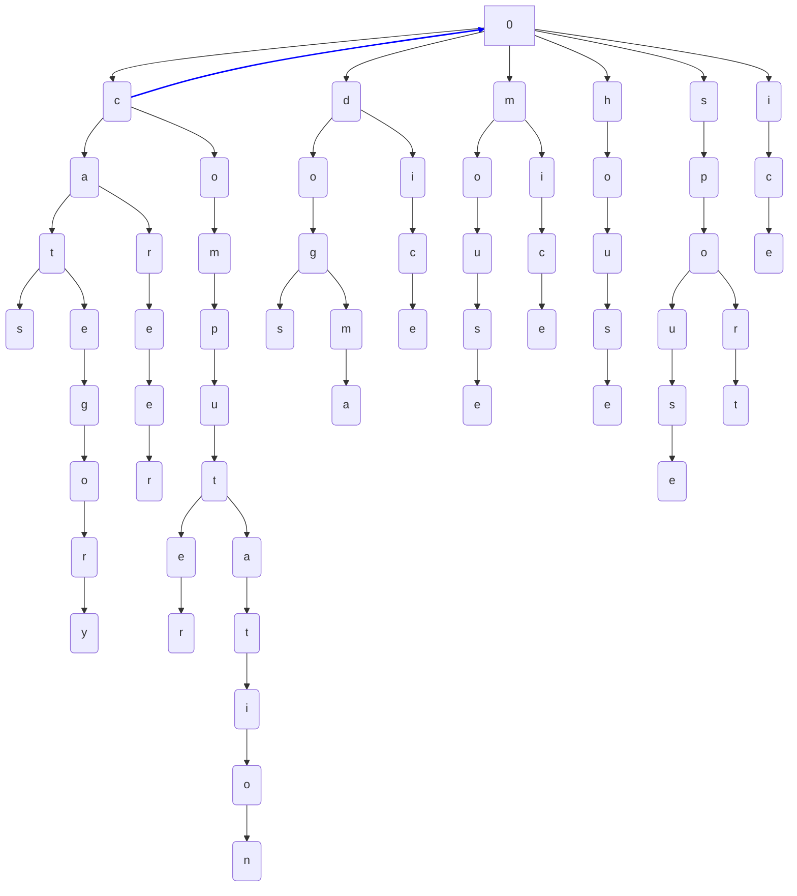

```mermaid

%% Define arrow style


graph TD
0-->1(c)
1-->0
0-->2(d)
0-->3(m)
0-->4(h)
0-->5(s)
0-->6(i)
1-->7(a)
1-->8(o)
2-->9(o)
2-->10(i)
3-->11(o)
3-->12(i)
4-->13(o)
5-->14(p)
6-->15(c)
7-->16(t)
7-->17(r)
8-->18(m)
9-->19(g)
10-->20(c)
11-->21(u)
12-->22(c)
13-->23(u)
14-->24(o)
15-->25(e)
16-->26(s)
16-->27(e)
17-->28(e)
18-->29(p)
19-->30(s)
19-->31(m)
20-->32(e)
21-->33(s)
22-->34(e)
23-->35(s)
24-->36(u)
24-->37(r)
27-->38(g)
28-->39(e)
29-->40(u)
31-->41(a)
33-->42(e)
35-->43(e)
36-->44(s)
37-->45(t)
38-->46(o)
39-->47(r)
40-->48(t)
44-->49(e)
46-->50(r)
48-->51(e)
48-->52(a)
50-->53(y)
51-->54(r)
52-->55(t)
55-->56(i)
56-->57(o)
57-->58(n)


%% linkStyle 0 stroke:blue,stroke-width:
linkStyle 1 stroke:blue, fill:none, stroke-width: 2px;


```