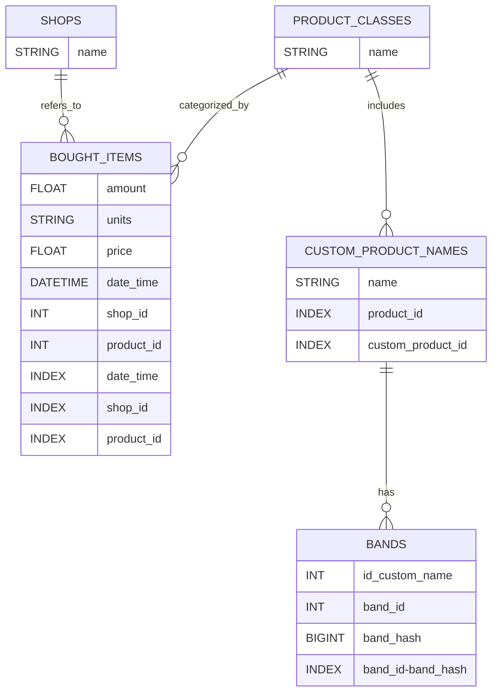

# Programmer manual
*this one is written in english because the whole program is written in english, but it is meant for czech users - czech shops so the user one is in czech*

- program is written in **Python** and **MySQL**
- to run it you run the __main__.py file, it will import other files as a library:

### `mainInput.py`:
- calls `imageToText.py` which uses OCR API to get text from image of receipt
- calls `textAnalyzer.py` firs converts, using Large Language Model (LLM) like llama-3.3-70b to JSON
- than is is validated and we try to first assign what "class" every bought item belongs to using `database_conn.py` - 
    
    with "class" we mean that every shop name they'r products in some wired way, we need to find what did they mean by that e.g. wee need to assign "apple" to "red apples" or *czech: "sadlo" to "skvarene 250g"*

    
- so with `assign_by_database.py` we try to find what "class" by looking to past occurrences of similar name for that we use:
    - first using Locality Sensitive Hashing (LSH) with MinHash [see explanation here](https://medium.com/@omkarsoak/from-min-hashing-to-locality-sensitive-hashing-the-complete-process-b88b298d71a1)
    - And with candidates from this we for every of them calculate Levenshtein distance [see here](https://en.wikipedia.org/wiki/Levenshtein_distance)
- if `assign_by_database` don't find anything we use `assign_by_LLM.py` which asks LLM to find how might the product be called and again try to find that product in database (Regex for this would be really hard to implement)
- than `communicator.py` is used to show user what program identified he bought and user can change it
- than everything is stored in database

### `mainOutput.py`:
- presents user with possibilities to what he can see and than runs query in database to find it (sadly I wrote it so that if you want to change type of database, you would need to change queries here also)

### This is how scheme of MySQL database looks like:

